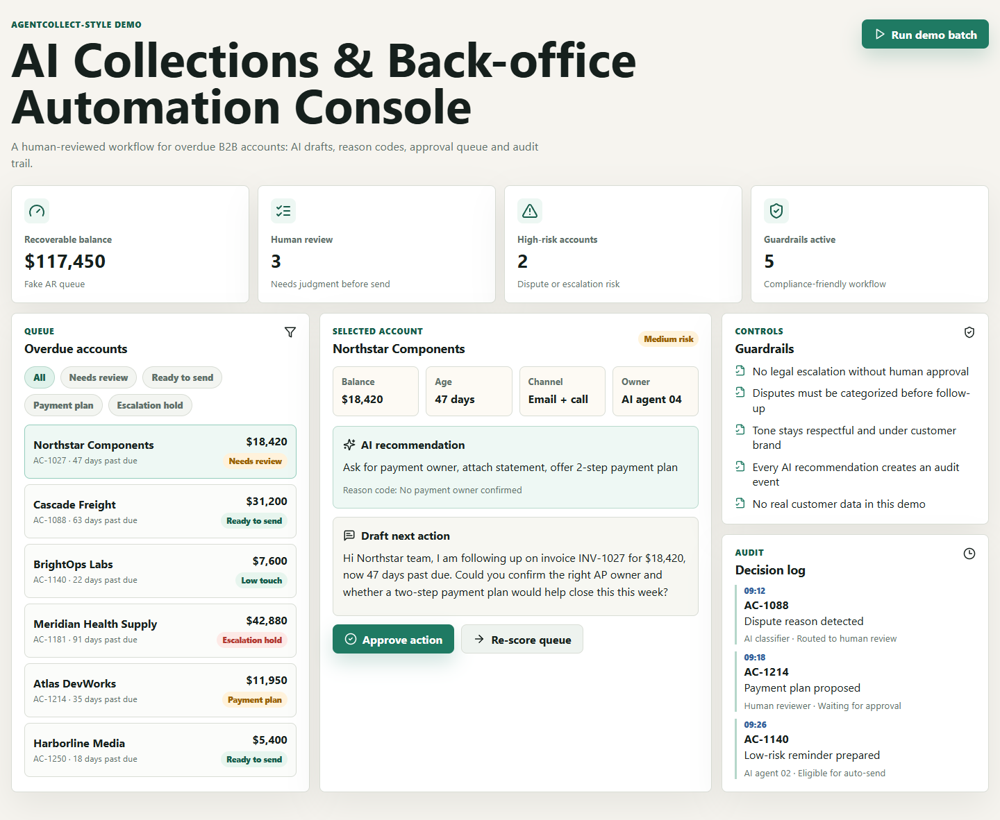

# AI Collections & Back-office Automation Console

[](https://github.com/Daniel5569/ai-collections-console/actions/workflows/ci.yml)





This is not affiliated with AgentCollect. It is a portfolio demo built around the kind of workflow an AI collections company needs: overdue account queue, AI-drafted next actions, reason codes, human approval and audit logs.

## What It Shows

- Overdue B2B accounts with balances, risk levels and days past due
- AI-style suggested next action for each account
- Forecast recovery estimate and recovery score per account
- Draft email/call/payment-plan text
- Suggested payment path for human review
- Human approval queue
- Guardrails for disputes, escalation and brand-safe communication
- Audit trail after every demo action

## Why It Is Relevant

AI collections products do not only need model calls. They need operational control:

- visibility for finance teams
- safe handling of disputes
- approval before escalation
- clear reason codes
- score-based prioritization
- logging for review and compliance
- fast internal dashboards for account status

That matches the kind of internal tool, workflow automation and AI product execution useful for founder-led startups.

## Tech Stack

- **Next.js 15** with App Router and TypeScript 5.7
- **React 19** — client components, `useState`, `useMemo`, `useEffect`
- **REST API** — `GET /api/accounts`, `GET /api/accounts/:id`
- **Lucide React** for icons (minimal dependency footprint)
- Pure CSS design system with custom properties (no Tailwind)
- Node.js native test runner with `tsx` for TypeScript tests

## Run Locally

```bash
npm install
npm run dev
```

Then open:

```text
http://127.0.0.1:3000
```

Quality checks:

```bash
npm run check
```

The check command runs lint, type check, unit tests, production build and dependency audit.

## Docker

```bash
docker build -t ai-collections-console .
docker run -p 3000:3000 ai-collections-console
```

## API

The API routes serve deterministic demo data so reviewers can inspect the full-stack shape without requiring external services.

| Method | Route | Description |
|--------|-------|-------------|
| `GET` | `/api/accounts` | All overdue accounts |
| `GET` | `/api/accounts/:id` | Single account by ID |

## Demo Script

1. Open the dashboard and show total recoverable balance, review count and high-risk accounts.
2. Filter to `Needs review` or `Escalation hold`.
3. Select an account and explain the AI recommendation plus reason code.
4. Show the draft next action.
5. Point to the forecast recovery and payment path to show business prioritization.
6. Click `Approve action` and point to the audit log update.
7. Click `Run demo batch` and show the queue metrics and statuses changing.
8. Use search/sort to find a high-risk or large-balance account.
9. Explain that the useful part is not the fake AI text, but the human-reviewed workflow around it.

## Local Artifacts

- `Founder_Demo_Brief_AgentCollect_2026-06-11.docx` is an intentional founder demo brief; see `docs/README.md`.
- `screenshots/` keeps final desktop/mobile evidence captures.

## Deliberate Limits

- Fake customer data only
- No real AI API call (see `.env.example` for plugging in a live LLM)
- No collection/legal advice
- No production claim
- No sensitive data

## Next Improvements

- Add Supabase/PostgreSQL schema and real persistence
- Add role-based review states and auth (NextAuth)
- Add CSV import for overdue accounts
- Add payment-plan calculator
- Add exportable audit log
- Add source-of-truth sync with CRM/accounting tools
- Wire in a real LLM API for live AI recommendations
